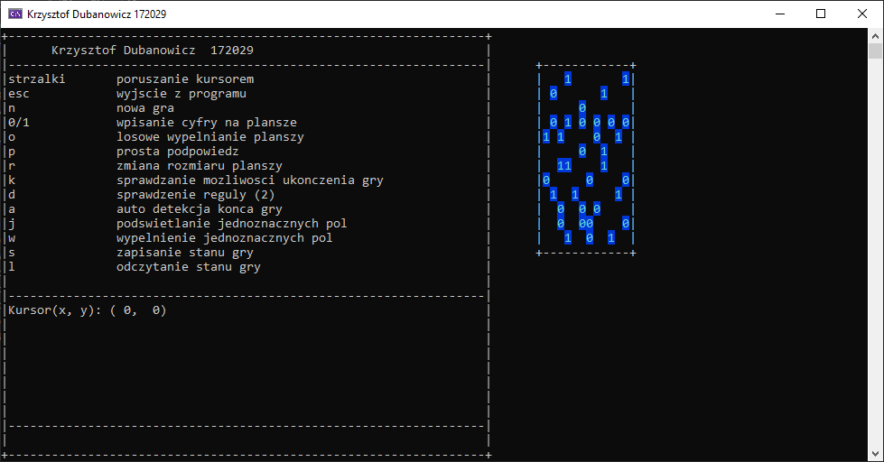

# BinaryPuzzle

Binary puzzle is a logic puzzle that can be solved just by reasoning. [Online example](http://www.binarypuzzle.com/)

BinaryPuzzle is an implementation of this game in C++, written as first academic project in 2017. It wasn't updated since then.
The interface is in Polish.

### Features
* A previously made board
* Random generated board
* Simple hint
* Any sized boards
* Checking for board contradictions
* Counting zeros and ones in rows and columns
* Check if board is completed
* Conclusive field hints
* Auto-filling conclusive fields
* Saving and loading the game

